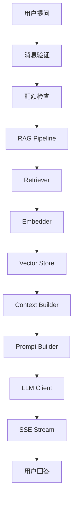
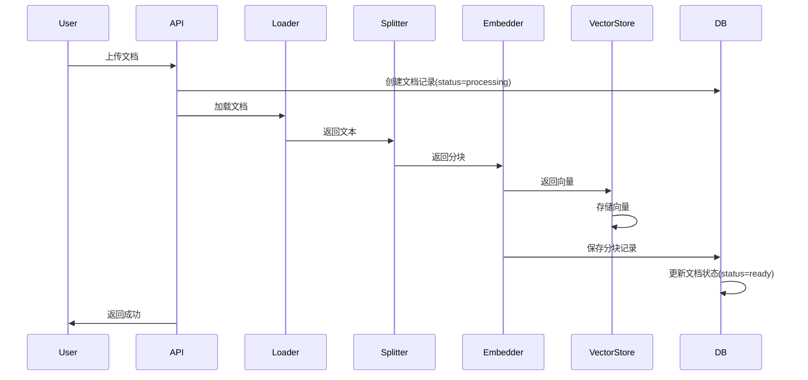
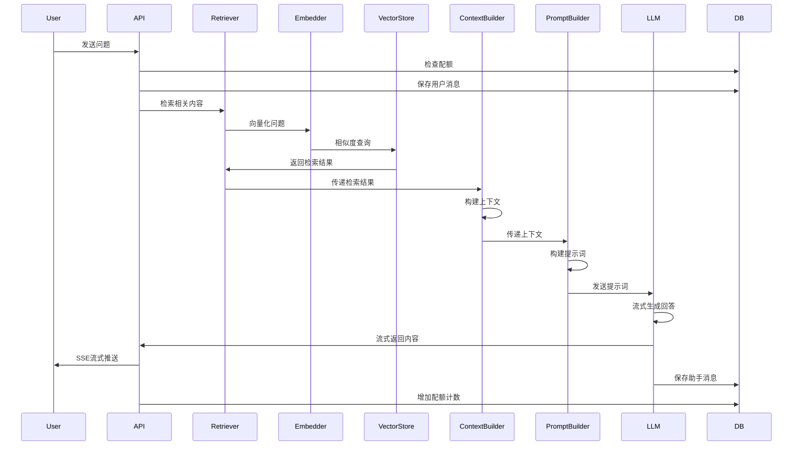

# AI架构设计

## 概述

AI智能客服系统采用RAG（检索增强生成）架构，结合向量检索和大语言模型生成，实现基于知识库的智能问答。

## 整体架构



## 核心模块

### 1. Document Loader（文档加载器）

**文件**: `app/rag/loader.py`

**功能**: 从不同格式的文件中提取文本内容

**支持格式**:
- txt: 纯文本文件
- md: Markdown文件
- pdf: PDF文件（使用PyMuPDF）

**关键方法**:
- `load_txt()`: 加载txt文件
- `load_md()`: 加载md文件
- `load_pdf()`: 加载pdf文件
- `load()`: 根据文件类型自动选择加载器

**设计要点**:
- 支持UTF-8和GBK编码
- PDF使用PyMuPDF进行文本提取
- 统一的错误处理和日志记录

---

### 2. Text Splitter（文本分割器）

**文件**: `app/rag/splitter.py`

**功能**: 将长文档分割成适合向量化的文本块

**分割策略**:
- 递归字符分割
- 中文优先分隔符：段落、句号、感叹号、问号、分号、逗号
- 块大小：500字符
- 块重叠：80字符

**关键方法**:
- `split_text()`: 主分割方法
- `_recursive_split()`: 递归分割实现
- `_split_by_character()`: 字符级分割（最后手段）

**设计要点**:
- 中文优化的分隔符顺序
- 保持语义完整性
- 重叠确保上下文连续性

---

### 3. Embedder（向量化器）

**文件**: `app/rag/embedder.py`

**功能**: 将文本转换为向量表示

**支持模型**:
- DashScope: text-embedding-v3（1024维）
- 本地: sentence-transformers（768维）

**关键方法**:
- `embed()`: 单文本向量化
- `embed_batch()`: 批量向量化（batch_size=16）
- `retry_embed()`: 带重试的向量化

**设计要点**:
- 批量处理提升效率
- 指数退避重试机制
- 支持云端和本地模型切换

---

### 4. Vector Store（向量存储）

**文件**: `app/rag/vector_store.py`

**功能**: 存储和检索向量

**技术**: Chroma向量数据库

**关键方法**:
- `add_embeddings()`: 添加向量
- `query()`: 向量相似度查询
- `delete_by_ids()`: 按ID删除
- `delete_by_metadata()`: 按元数据删除

**设计要点**:
- 持久化存储
- 元数据过滤支持
- 批量删除优化

---

### 5. Retriever（检索器）

**文件**: `app/rag/retriever.py`

**功能**: 根据查询检索相关文档块

**检索策略**:
- Top-K检索（默认K=8）
- 相似度阈值过滤（默认0.6）
- 降级机制（阈值降至0.3）

**关键方法**:
- `retrieve()`: 标准检索
- `retrieve_with_fallback()`: 带降级的检索

**设计要点**:
- 余弦相似度计算
- 阈值过滤低质量结果
- 降级保证可用性

---

### 6. Context Builder（上下文构建器）

**文件**: `app/rag/context_builder.py`

**功能**: 从检索结果构建上下文

**构建策略**:
- Token预算控制（2000 tokens）
- 内容去重
- 按相似度排序

**关键方法**:
- `build_context()`: 构建上下文
- `build_context_with_sources()`: 构建上下文并返回来源

**设计要点**:
- 近似Token计算（1 token ≈ 2字符）
- 内容哈希去重
- 来源信息提取

---

### 7. Prompt Builder（提示构建器）

**文件**: `app/rag/prompt_builder.py`

**功能**: 构建LLM提示词

**提示模板**:
```
你是一个智能客服助手，负责回答用户关于产品和服务的问题。

请根据以下知识库内容回答用户的问题。如果知识库中没有相关信息，请明确告知用户你无法回答该问题，不要编造信息。

回答要求：
1. 准确、简洁、友好
2. 基于提供的知识库内容
3. 如果信息不足，请说明
4. 使用中文回答
```

**关键方法**:
- `build_prompt()`: 构建标准提示
- `build_fallback_prompt()`: 构建降级提示（无上下文）

**设计要点**:
- 系统消息定义角色
- 上下文注入
- 历史对话支持（最近5轮）

---

### 8. LLM Client（大语言模型客户端）

**文件**: `app/rag/llm_client.py`

**功能**: 调用大语言模型生成回答

**支持模型**:
- DashScope: qwen-plus
- 本地: Ollama（可配置）

**关键方法**:
- `chat()`: 非流式对话
- `chat_stream()`: 流式对话
- `fallback_to_ollama()`: 降级到本地模型

**设计要点**:
- 统一接口抽象
- 流式输出支持
- 模型切换降级

---

## RAG Pipeline流程

### 文档上传流程



### 聊天问答流程



## 性能优化

### 1. 批量处理
- 向量化批量处理（batch_size=16）
- 向量存储批量添加
- 减少API调用次数

### 2. 缓存策略
- Chroma持久化存储
- 向量ID与MySQL记录一一对应
- 避免重复向量化

### 3. 异步处理
- 文档上传异步后台处理
- 流式响应减少等待时间
- 非阻塞I/O

### 4. 降级机制
- 相似度阈值降级
- LLM模型降级（云端→本地）
- 空检索降级提示

## 可靠性设计

### 1. 错误处理
- 每个模块独立异常处理
- 详细的日志记录
- 友好的错误提示

### 2. 数据一致性
- 文档删除状态机（processing→deleting）
- MySQL与Chroma数据对账
- 事务保证原子性

### 3. 重试机制
- 向量化指数退避重试
- LLM调用重试
- 网络请求超时处理

## 扩展性设计

### 1. 模型切换
- 支持多种LLM提供商
- 支持多种Embedding模型
- 配置化模型选择

### 2. 多知识库
- kb_id字段支持多知识库
- 元数据过滤支持
- 知识库隔离

### 3. 分层架构
- API层：接口定义
- Service层：业务逻辑
- RAG Core层：AI核心
- Infra层：基础设施

## 监控指标

### 1. 检索质量
- 检索相似度分布
- Top-K命中率
- 阈值过滤率

### 2. 生成质量
- Token使用量
- 响应延迟
- 完成原因分布

### 3. 系统性能
- 向量化时间
- 检索时间
- 生成时间
- 端到端延迟
