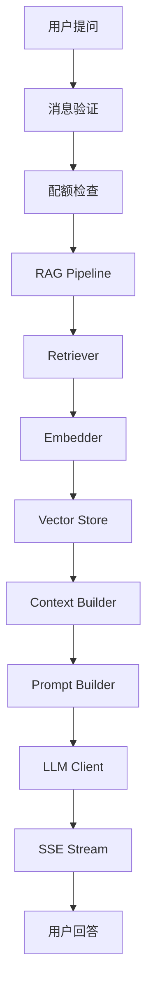
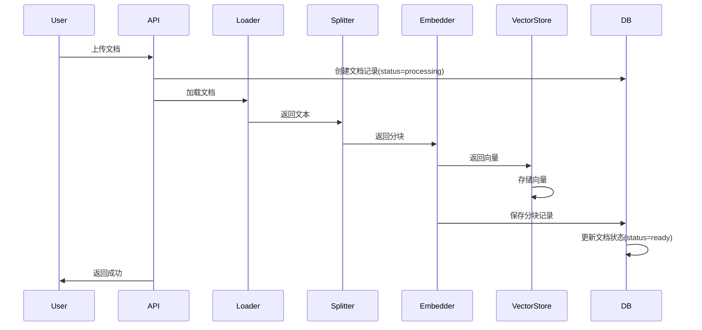
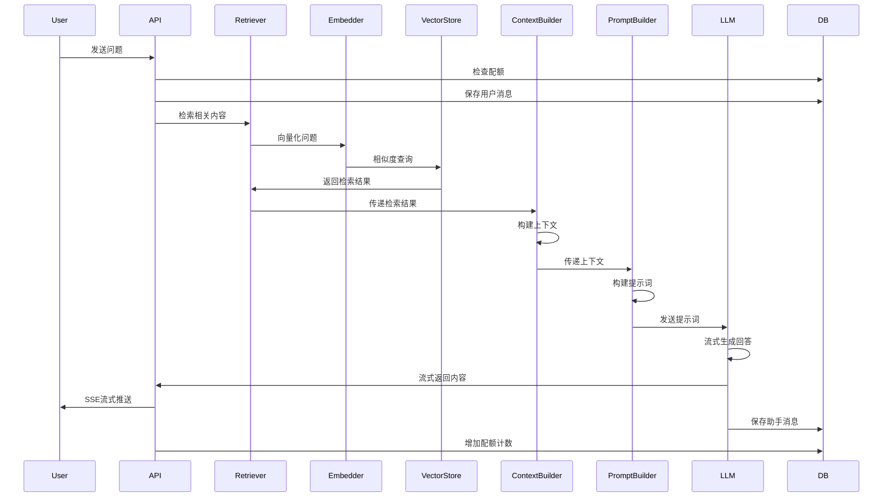

# AI架构设计

## 概述

AI智能客服系统采用RAG（检索增强生成）架构，结合向量检索和大语言模型生成，实现基于知识库的智能问答。

## 设计原则

### 单意图RAG设计
本项目核心仍为**统一的检索→生成管道**。在保留该管道的基础上，新增一层轻量**意图识别与策略路由**（详见下文独立章节），用于：
- **兜底分流**：闲聊/越界/未知 query 不再强行检索知识库，而是走无上下文兜底提示，从源头杜绝无关内容注入；
- **多意图扩展**：为后续按业务意图接入工具/API（如订单查询、账号操作）预留清晰路由边界。

设计考量（与原单意图设计一致的部分）：
- **简化架构**：意图分类采用确定性规则词典（零额外 LLM 调用），不引入独立分类模型服务，复杂度可控；
- **聚焦核心**：知识类意图仍走统一的检索→生成管道，检索质量与回答准确性是主线；
- **成本控制**：默认不启用 LLM 兜底分类（`intent_fallback_to_llm=false`），保持零额外 LLM 调用；
- **维护性**：路由为纯函数单分发，易于调试。

> 演进说明：早期版本将 `sessions.intent_tag` / `messages.intent` 视为历史遗留字段；现 `messages.intent` 已由意图分类器在每次对话时落库，用于观测与回溯。

## 整体架构



## 核心模块

### 1. Document Loader（文档加载器）

**文件**: `app/rag/loader.py`

**功能**: 从不同格式的文件中提取文本内容

**支持格式**:
- txt: 纯文本文件
- md: Markdown文件
- pdf: PDF文件（使用PyMuPDF）

**关键方法**:
- `load_txt()`: 加载txt文件
- `load_md()`: 加载md文件
- `load_pdf()`: 加载pdf文件
- `load()`: 根据文件类型自动选择加载器

**设计要点**:
- 支持UTF-8和GBK编码
- PDF使用PyMuPDF进行文本提取
- 统一的错误处理和日志记录

---

### 2. Text Splitter（文本分割器）

**文件**: `app/rag/splitter.py`

**功能**: 将长文档分割成适合向量化的文本块

**分割策略**:
- 递归字符分割
- 中文优先分隔符：段落、句号、感叹号、问号、分号、逗号
- 块大小：500字符
- 块重叠：80字符

**关键方法**:
- `split_text()`: 主分割方法
- `_recursive_split()`: 递归分割实现
- `_split_by_character()`: 字符级分割（最后手段）

**设计要点**:
- 中文优化的分隔符顺序
- 保持语义完整性
- 重叠确保上下文连续性

---

### 3. Embedder（向量化器）

**文件**: `app/rag/embedder.py`

**功能**: 将文本转换为向量表示

**支持模型**:
- DashScope: text-embedding-v3（1024维，当前唯一支持的嵌入提供方；本地 sentence-transformers 方案已移除）

**关键方法**:
- `embed()`: 单文本向量化
- `embed_batch()`: 批量向量化（batch_size=16）
- `retry_embed()`: 带重试的向量化

**设计要点**:
- 批量处理提升效率
- 指数退避重试机制
- 仅支持云端 DashScope（本地模型切换路径已移除）

---

### 4. Vector Store（向量存储）

**文件**: `app/rag/vector_store.py`

**功能**: 存储和检索向量

**技术**: Chroma向量数据库

**关键方法**:
- `add_embeddings()`: 添加向量
- `query()`: 向量相似度查询
- `delete_by_ids()`: 按ID删除
- `delete_by_metadata()`: 按元数据删除

**设计要点**:
- 持久化存储
- 元数据过滤支持
- 批量删除优化

---

### 5. Retriever（检索器）

**文件**: `app/rag/retriever.py`

**功能**: 根据查询检索相关文档块

**检索策略**:
- Top-K检索（默认K=8）
- 相似度阈值过滤（默认0.5；依据实测分布：相关0.55~0.74 / 无关0.40~0.42，0.5为干净分界）
- 检索降级：**默认不做阈值降级**（旧实现降到0.3会把无关内容0.40~0.42重新漏入上下文）。空结果直接由上层走无上下文兜底提示；如需受限召回兜底，可配置 `retrieval_fallback_threshold`（建议≥0.45，须高于无关带），仅在低于主阈值时按受限下限再检索一次。

**关键方法**:
- `retrieve()`: 标准检索
- `retrieve_with_fallback()`: 带降级的检索

**设计要点**:
- 余弦相似度计算
- 阈值过滤低质量结果
- 降级保证可用性

---

### 6. Context Builder（上下文构建器）

**文件**: `app/rag/context_builder.py`

**功能**: 从检索结果构建上下文

**构建策略**:
- Token预算控制（2000 tokens）
- 内容去重
- 按相似度排序

**大规模检索 LLM 执行保障（L1-L4 算子，对应笔试题加分项）**:
- **L1 重排（cross-encoder）**：对 top_k 召回结果用 cross-encoder 重排，融合规则分数。`enable_reranker` 控制，**默认关闭**（小语料下 top_k=8 已足够；启用需 `sentence-transformers`/`FlagEmbedding` 依赖与 `BAAI/bge-reranker-v2-m3` 模型）。
- **L2 三明治布局**：高置信块置顶+置底（首尾注意力权重高），中低置信居中。**默认启用**。
- **L3 分层摘要（Map-Reduce）**：召回片段过多时，Map 逐块摘要→Reduce 汇总，防 token 溢出与注意力稀释。**默认关闭**（小语料无需；大语料开启）。
- **L4 校验**：剔除 [K编号] 越界/低分块，与引用一致性核对。**默认启用**。

> 设计取舍：L1/L3 默认关闭是针对当前小语料（3 篇种子文档、15~29 块）的务实选择，避免引入重模型下载开销；大语料场景开启 L1/L3 可进一步保障"不遗漏关键规则、不因信息过载产生幻觉"。

**关键方法**:
- `build_context()`: 构建上下文
- `build_context_with_sources()`: 构建上下文并返回来源

**设计要点**:
- 近似Token计算（1 token ≈ 2字符）
- 内容哈希去重
- 来源信息提取

---

### 7. Prompt Builder（提示构建器）

**文件**: `app/rag/prompt_builder.py`

**功能**: 构建LLM提示词

**提示模板**:
```
你是一个智能客服助手，负责回答用户关于产品和服务的问题。

请根据以下知识库内容回答用户的问题。如果知识库中没有相关信息，请明确告知用户你无法回答该问题，不要编造信息。

回答要求：
1. 准确、简洁、友好
2. 基于提供的知识库内容
3. 如果信息不足，请说明
4. 使用中文回答
```

**关键方法**:
- `build_prompt()`: 构建标准提示
- `build_fallback_prompt()`: 构建降级提示（无上下文）

**设计要点**:
- 系统消息定义角色
- 上下文注入
- 历史对话支持（最近5轮）

---

### 8. LLM Client（大语言模型客户端）

**文件**: `app/rag/llm_client.py`

**功能**: 调用大语言模型生成回答

**支持模型**:
- DashScope: qwen-plus（通义千问，当前唯一支持的大模型提供方）

**关键方法**:
- `chat()`: 非流式对话
- `chat_stream()`: 流式对话
- `fallback_to_ollama()`: 降级到本地模型（已移除，当前 LLM 异常统一返回错误）

**设计要点**:
- 统一接口抽象
- 流式输出支持
- 模型切换降级

---

## 意图识别与策略路由（Agent 核心层）

在单意图 RAG 主链路之上增加一层轻量、确定性的意图门控，解决"无关内容漏入上下文"与"多业务意图扩展"两类问题。

### 1. 意图识别（`app/agent/intent_classifier.py`）

将用户 query 归类为 `qa_set.json` 定义的 7 类业务意图：

| 意图 | 含义 | 路由目标 |
|------|------|----------|
| 产品咨询 | 功能/能力/接入/语言 | RAG |
| 价格套餐 | 价格/版本/试用/收费 | RAG |
| 退款售后 | 退货/退款/售后/保修 | RAG |
| 账号登录 | 注册/登录/密码 | RAG |
| 知识库文档 | 上传/格式/向量化 | RAG |
| 订单 | 查单/物流/改单 | RAG |
| 兜底闲聊 | 闲聊/越界/未知 | 兜底提示 |

**分类方法**：
- 主分类器为「规则 + 加权词典」分类器，**零额外 LLM 调用**（满足成本控制原则）。
- 打分采用「最长匹配优先 + 非重叠区间」，避免子串重复计分（如"核心功能"不会同时计"功能"的分）。
- 各意图最佳加权分 < `intent_confidence_threshold`（默认 1.0，即至少命中一个有效业务词）时，统一归为兜底闲聊。
- 可选 `intent_fallback_to_llm`：规则低置信时调用一次 LLM 做结构化判定，默认关闭。

### 2. 策略路由（`app/agent/router.py`）

纯函数 `route(intent) -> RAG | FALLBACK`：
- 知识类意图 → **RAG 主链路**（检索→上下文→生成）；
- 兜底/未知意图 → **无上下文兜底提示**（不检索、不注入知识库内容）。

**健壮性**：
- 单分发、终态，**无循环/递归**风险；
- 任何未登记/未知意图一律收敛到 FALLBACK，**无路由遗漏**分支；
- 扩展新意图只需在 `KNOWLEDGE_INTENTS` 登记即接入 RAG，否则自动兜底。

### 3. 与 RAG 阈值的双保险

无关 query（如"天气"）被拦截有两道防线：
1. **阈值 0.5**：在 Retriever 层过滤掉相似度 0.40~0.42 的无关 chunk；
2. **意图门控**：在路由层直接判定为兜底闲聊，根本不进入检索，彻底避免无关内容注入。

### 4. 多租户隔离增强（`retriever` / `vector_store` / `knowledge_service`）

- 文档切分入库时在 chunk 元数据写入 `user_id`；
- `retriever.retrieve` / `vector_store.query` 新增可选 `user_id` 参数，传入时按归属用户过滤；
- 默认不传（保持单租户共享 KB 现状），为未来多租户隔离预留能力，不改变现有行为。

## RAG Pipeline流程

### 文档上传流程



### 聊天问答流程



## 性能优化

### 1. 批量处理
- 向量化批量处理（batch_size=16）
- 向量存储批量添加
- 减少API调用次数

### 2. 缓存策略
- Chroma持久化存储
- 向量ID与MySQL记录一一对应
- 避免重复向量化

### 3. 异步处理
- 文档上传异步后台处理
- 流式响应减少等待时间
- 非阻塞I/O

### 4. 降级机制
- 相似度阈值降级
- LLM模型降级（云端→本地）
- 空检索降级提示

## 可靠性设计

### 1. 错误处理
- 每个模块独立异常处理
- 详细的日志记录
- 友好的错误提示

### 2. 数据一致性
- 文档删除状态机（processing→deleting）
- MySQL与Chroma数据对账
- 事务保证原子性

### 3. 重试机制
- 向量化指数退避重试
- LLM调用重试
- 网络请求超时处理

## 扩展性设计

### 1. 模型切换
- 支持多种LLM提供商
- 支持多种Embedding模型
- 配置化模型选择

### 2. 多知识库
- kb_id字段支持多知识库
- 元数据过滤支持
- 知识库隔离

### 3. 分层架构
- API层：接口定义
- Service层：业务逻辑
- RAG Core层：AI核心
- Infra层：基础设施

## 监控指标

### 1. 检索质量
- 检索相似度分布
- Top-K命中率
- 阈值过滤率

### 2. 生成质量
- Token使用量
- 响应延迟
- 完成原因分布

### 3. 系统性能
- 向量化时间
- 检索时间
- 生成时间
- 端到端延迟
