# 业务流程说明

## 概述

本文档描述AI智能客服系统的核心业务流程，包括用户注册登录、知识库管理、智能问答等关键业务场景。

## 用户注册登录流程

### 注册流程

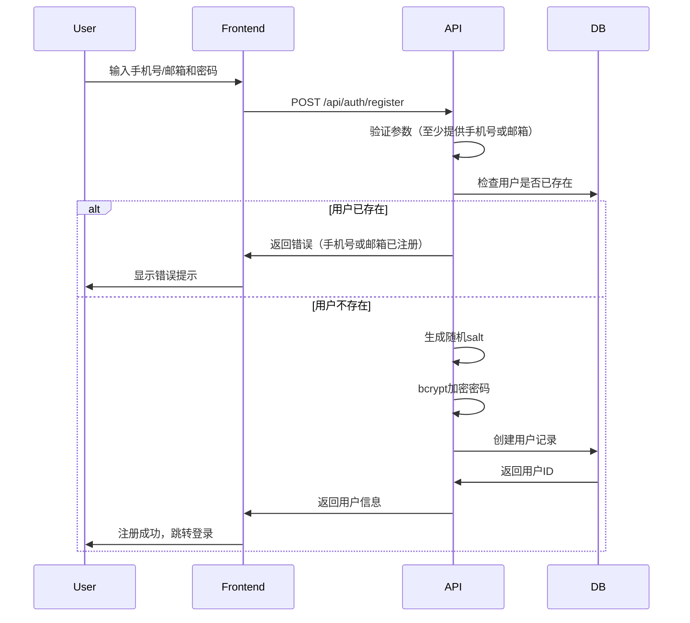

**业务规则**：
- 手机号和邮箱至少提供一个
- 密码长度6-100字符
- 手机号和邮箱唯一性校验
- 密码使用bcrypt加密存储

---

### 登录流程

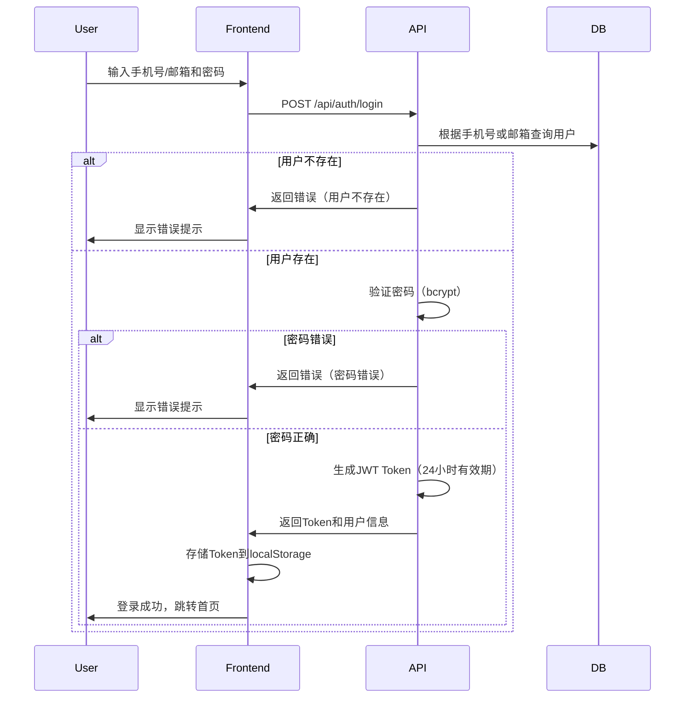

**业务规则**：
- 支持手机号或邮箱登录
- JWT Token有效期24小时
- Token存储在localStorage
- 每次请求携带Token在Authorization头

---

## 知识库管理流程

### 文档上传流程

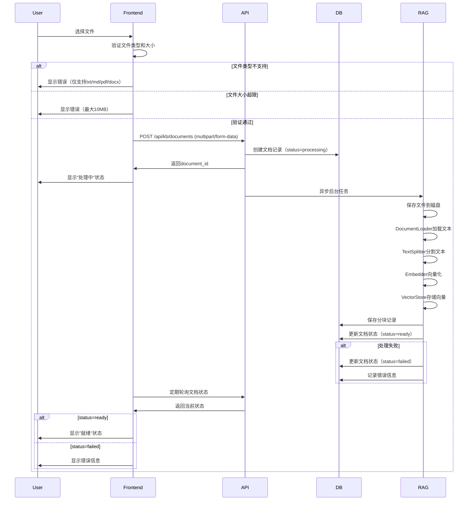

**业务规则**：
- 支持格式：txt、md、pdf、docx
- 文件大小限制：10MB
- 异步后台处理
- 状态机：processing → ready/failed
- 文档删除时级联删除向量

---

### 文档删除流程

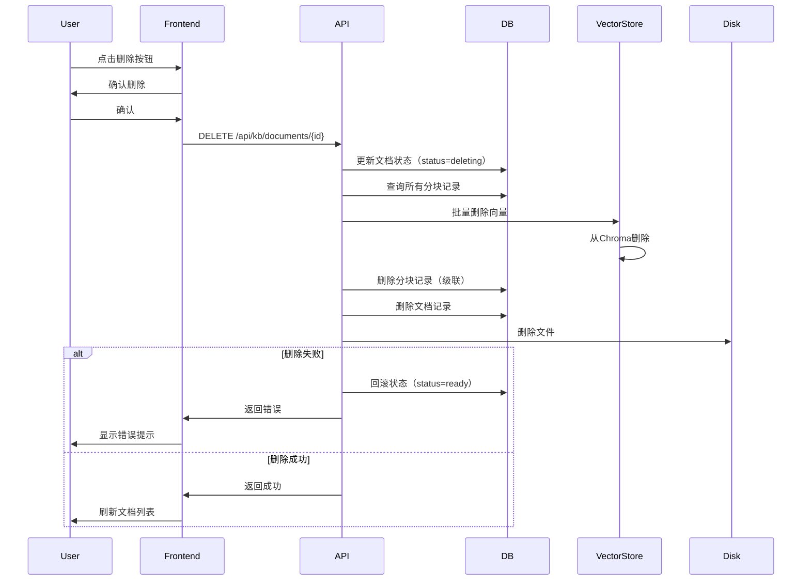

**业务规则**：
- 状态机保证一致性
- 先更新状态再执行删除
- MySQL和Chroma数据同步删除
- 失败时回滚状态

---

## 智能问答流程

### 单轮问答流程

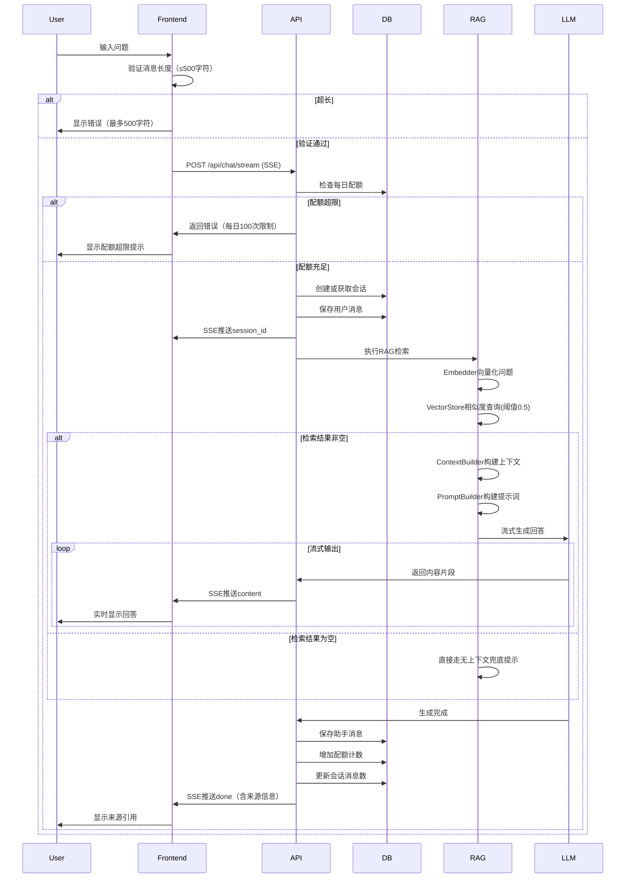

**业务规则**：
- 消息长度限制：500字符
- 每日配额：100次提问
- **意图门控**：先经规则分类器判定意图——知识类意图（产品/价格/退款/账号/知识库/订单）走 RAG 主链路；兜底闲聊/越界意图走「直答」（不检索、不注入知识库）；空检索同样走无上下文兜底提示（固定话术，不调 LLM）
- 相似度阈值：0.5（不做阈值降级，检索为空直接走兜底提示）
- Top-K检索：8个结果
- **思维链流式**：RAG 链路在正式回答前经 SSE 推送 `thinking_start` → 若干 `thought` → `thinking_end`（基于真实检索上下文的实时推理），再推送 `content` 正文
- 流式响应提升体验
- 记录来源引用（回答中 `[K编号]` 与 `done.sources` 一一对应）

---

### 多轮对话流程

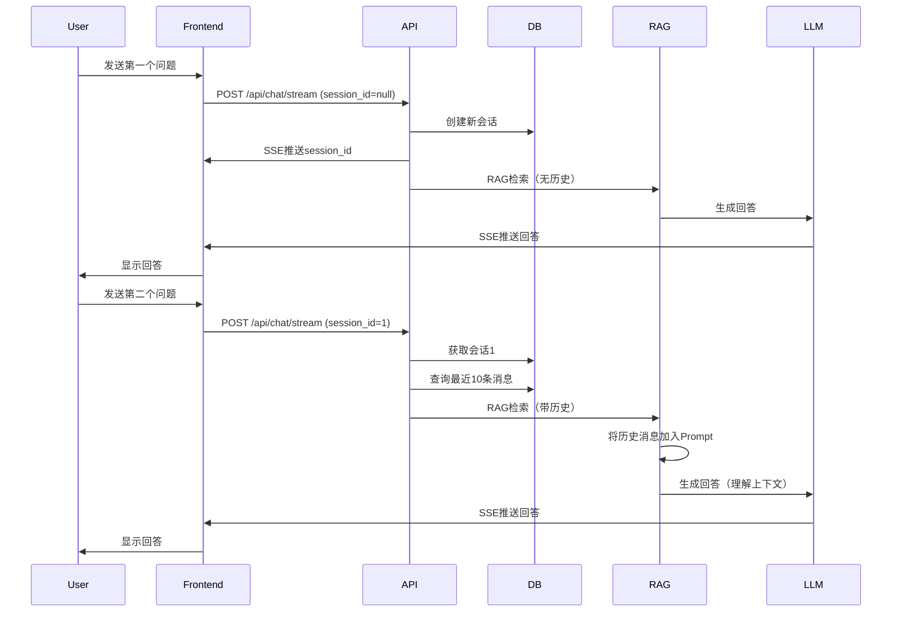

**业务规则**：
- 首次提问创建新会话
- 后续提问使用已有会话
- 保留最近5轮对话历史
- LLM理解上下文语境

---

## 反馈评价流程

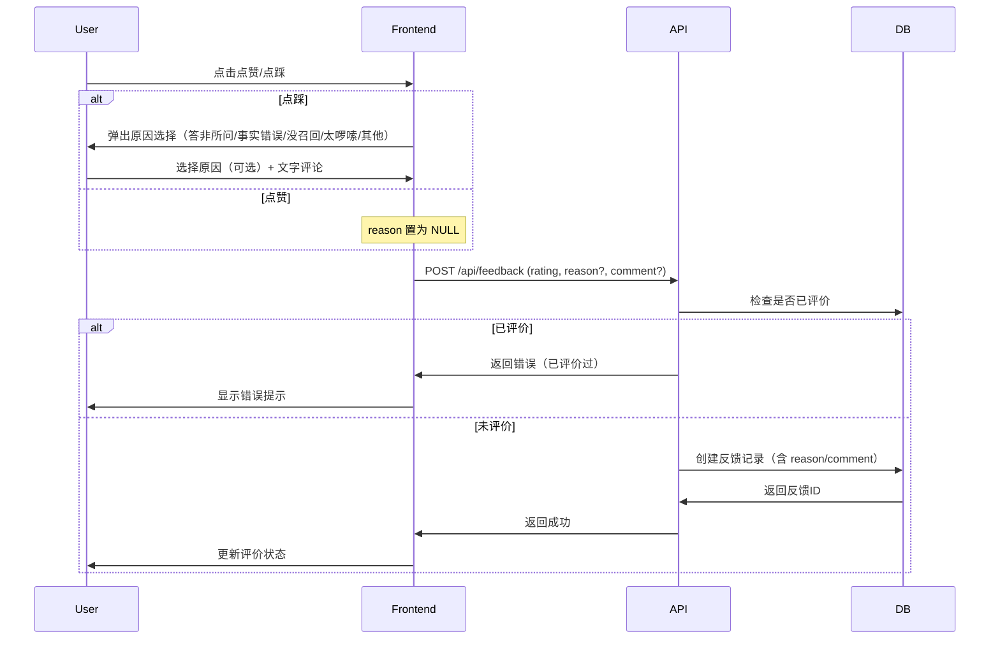

**业务规则**：
- 每条消息只能评价一次
- 评分：1（点赞）、-1（点踩）
- 可选文字评论（最多500字符）
- 点踩时可选择结构化原因（reason）：答非所问 / 事实错误 / 没召回 / 太啰嗦 / 其他；点赞时 reason 为 NULL
- 管理员可通过管理后台（GET /api/admin/feedbacks）查看全量反馈，并支持按评分、原因、关键词、时间区间筛选

### 管理员反馈分析与优化飞轮

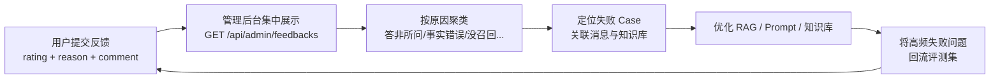

- 反馈数据经 `messages` 间接关联到 `sessions` 与用户账户（`email` 或 `phone`），管理员可见「用户 / 会话标题 / 关联消息内容」。
- 管理后台提供统计概览接口（`GET /api/admin/feedbacks/summary`）：总反馈数、点赞/点踩数、按原因分布，用于快速识别集中问题。
- 高频「没召回 / 事实错误」类反馈可转化为评测集用例，形成「收集 → 分析 → 优化 → 回流」的持续迭代闭环。

---

## 异常处理流程

### 配额超限处理

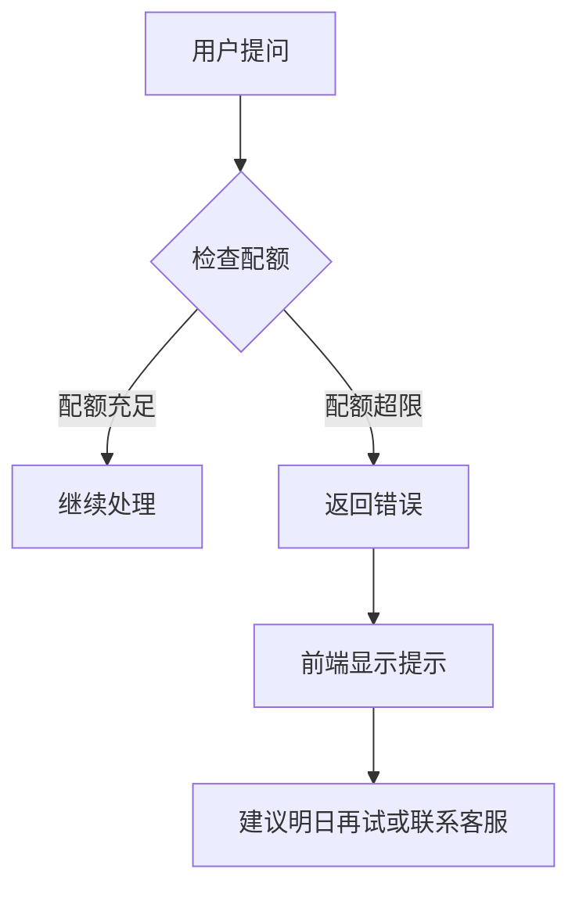

### 知识库空检索处理

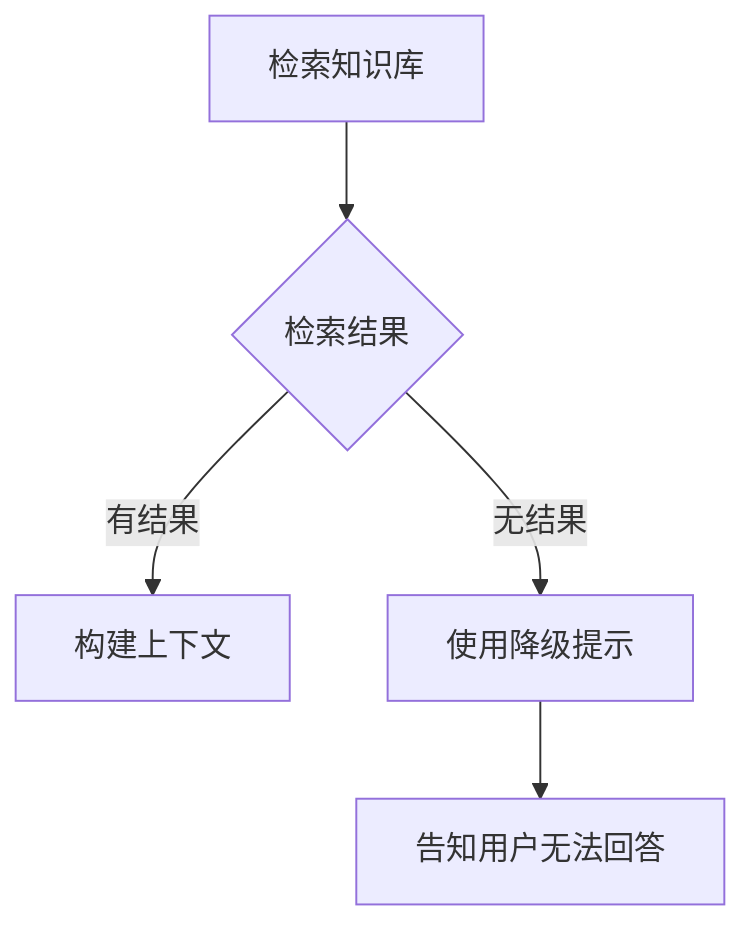

### LLM调用失败处理

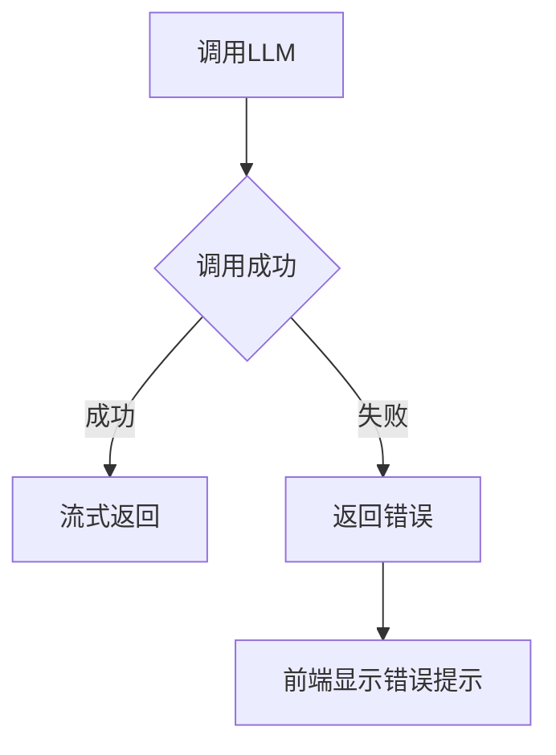

---

## 数据流转

### 文档上传数据流

```
用户文件 → API接收 → 磁盘存储 → 文本提取 → 文本分割 → 向量化 → Chroma存储 → MySQL记录
```

### 问答数据流

```
用户问题 → 向量化 → Chroma检索 → 结果过滤 → 上下文构建 → 提示构建 → LLM生成 → 流式返回 → MySQL存储
```

---

## 关键指标

### 性能指标
- 首字输出时间：<500ms
- 平均响应时间：<2s
- 文档处理时间：<3min（10MB文档）

### 质量指标
- 检索准确率：>80%
- 回答准确率：>75%
- 引用准确率：>90%

### 业务指标
- 日均提问量：100次/用户
- 文档处理成功率：>95%
- 用户满意度：>85%
