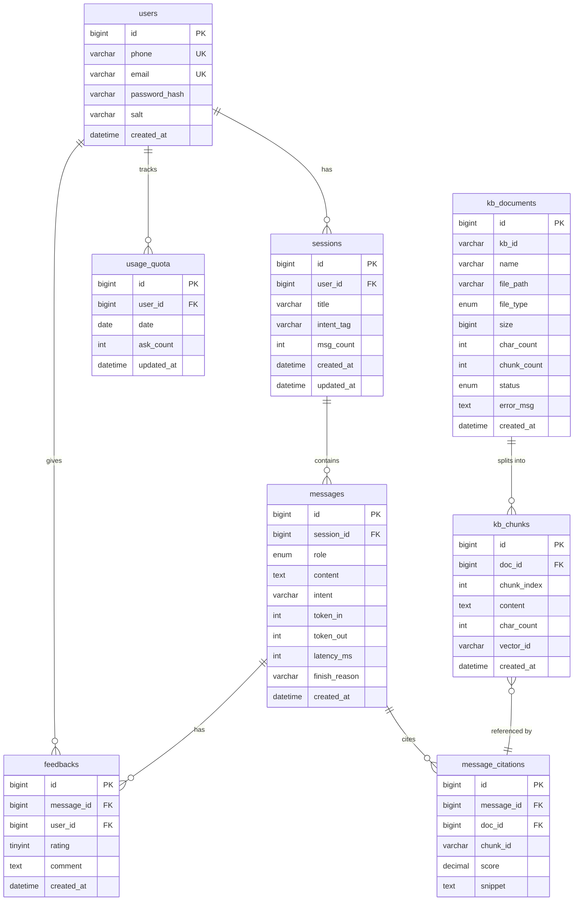

# 数据库设计文档

## 概述

AI智能客服系统采用MySQL 8.0作为关系型数据库，共设计8张表，涵盖用户管理、会话管理、消息记录、知识库管理、反馈评价等核心功能模块。

## ER图

## 表结构说明

### 1. users（用户表）

存储用户账户信息，支持手机号和邮箱两种登录方式。

| 字段名 | 类型 | 约束 | 说明 |
|--------|------|------|------|
| id | BIGINT UNSIGNED | PK, AUTO_INCREMENT | 用户ID |
| phone | VARCHAR(20) | NULL, UNIQUE | 手机号 |
| email | VARCHAR(255) | NULL, UNIQUE | 邮箱 |
| password_hash | VARCHAR(255) | NOT NULL | 密码哈希值（bcrypt） |
| salt | VARCHAR(64) | NOT NULL | 密码盐值 |
| created_at | DATETIME | DEFAULT CURRENT_TIMESTAMP | 创建时间 |

**索引设计：**
- `uk_phone`: phone字段唯一索引
- `uk_email`: email字段唯一索引
- `idx_created_at`: created_at普通索引

**设计要点：**
- phone和email允许其一为空，支持两种登录方式
- 密码使用bcrypt加密，salt增强安全性
- 唯一索引防止重复注册

---

### 2. sessions（会话表）

存储用户的对话会话信息，每个会话包含多轮对话。

| 字段名 | 类型 | 约束 | 说明 |
|--------|------|------|------|
| id | BIGINT UNSIGNED | PK, AUTO_INCREMENT | 会话ID |
| user_id | BIGINT UNSIGNED | FK, NOT NULL | 所属用户ID |
| title | VARCHAR(255) | NOT NULL, DEFAULT '新对话' | 会话标题（首条问题自动摘要） |
| intent_tag | VARCHAR(50) | NULL | 意图标签（product_consult/after_sale/chat/complaint） |
| msg_count | INT UNSIGNED | DEFAULT 0 | 消息数量 |
| created_at | DATETIME | DEFAULT CURRENT_TIMESTAMP | 创建时间 |
| updated_at | DATETIME | DEFAULT CURRENT_TIMESTAMP ON UPDATE | 更新时间 |

**索引设计：**
- `idx_user_updated`: (user_id, updated_at DESC)复合索引，支撑会话列表按更新时间排序
- `idx_intent`: intent_tag普通索引，支持按意图筛选

**外键约束：**
- `fk_user`: user_id → users(id) ON DELETE CASCADE

**设计要点：**
- title默认为"新对话"，后续可根据首条问题自动生成摘要
- intent_tag用于意图分类统计
- updated_at自动更新，用于会话列表排序

---

### 3. messages（消息表）

存储会话中的单条消息，包括用户提问和AI回答。

| 字段名 | 类型 | 约束 | 说明 |
|--------|------|------|------|
| id | BIGINT UNSIGNED | PK, AUTO_INCREMENT | 消息ID |
| session_id | BIGINT UNSIGNED | FK, NOT NULL | 所属会话ID |
| role | ENUM('user', 'assistant') | NOT NULL | 角色（用户/助手） |
| content | TEXT | NOT NULL | 消息内容 |
| intent | VARCHAR(50) | NULL | 消息意图分类 |
| token_in | INT UNSIGNED | DEFAULT 0 | 输入token数（LLM调用） |
| token_out | INT UNSIGNED | DEFAULT 0 | 输出token数（LLM调用） |
| latency_ms | INT UNSIGNED | DEFAULT 0 | 响应延迟（毫秒） |
| finish_reason | VARCHAR(50) | NULL | 结束原因（stop/length/no_context/error） |
| created_at | DATETIME | DEFAULT CURRENT_TIMESTAMP | 创建时间 |

**索引设计：**
- `idx_session_created`: (session_id, created_at)复合索引，支持按会话查询消息历史

**外键约束：**
- `fk_session`: session_id → sessions(id) ON DELETE CASCADE

**设计要点：**
- 记录token数和延迟，用于性能分析和成本统计
- finish_reason标记结束原因，no_context表示空检索兜底
- intent字段用于单条消息的意图分类

---

### 4. message_citations（消息引用表）

存储AI回答的引用来源，独立成表而非JSON字段，便于查询和统计。

| 字段名 | 类型 | 约束 | 说明 |
|--------|------|------|------|
| id | BIGINT UNSIGNED | PK, AUTO_INCREMENT | 引用ID |
| message_id | BIGINT UNSIGNED | FK, NOT NULL | 所属消息ID |
| doc_id | BIGINT UNSIGNED | NOT NULL | 引用文档ID |
| chunk_id | VARCHAR(100) | NOT NULL | 引用块ID（Chroma向量ID） |
| score | DECIMAL(5,4) | NOT NULL | 相似度分数（0-1） |
| snippet | TEXT | NOT NULL | 引用内容片段（落库时保存被引用块的**完整原文**，不再截断，避免历史回看时丢失引用信息） |

**索引设计：**
- `idx_message`: message_id普通索引，支持按消息查询引用
- `idx_doc`: doc_id普通索引，支持按文档查询被引用情况

**外键约束：**
- `fk_message`: message_id → messages(id) ON DELETE CASCADE

**设计要点：**
- 独立成表而非JSON字段，便于查询和统计
- score记录相似度，可用于分析检索质量
- snippet保存引用片段，便于展示和溯源

---

### 5. kb_documents（知识库文档表）

存储上传的文档元数据，支持异步处理状态机。

| 字段名 | 类型 | 约束 | 说明 |
|--------|------|------|------|
| id | BIGINT UNSIGNED | PK, AUTO_INCREMENT | 文档ID |
| kb_id | VARCHAR(50) | NOT NULL, DEFAULT 'default' | 知识库ID（支持多知识库） |
| name | VARCHAR(255) | NOT NULL | 文档名称 |
| file_path | VARCHAR(500) | NOT NULL | 文件存储路径 |
| file_type | ENUM('txt', 'md', 'pdf', 'docx') | NOT NULL | 文件类型（与 `loader.ALLOWED_UPLOAD_EXTS` 一致） |
| size | BIGINT UNSIGNED | NOT NULL | 文件大小（字节） |
| char_count | INT UNSIGNED | DEFAULT 0 | 字符数 |
| chunk_count | INT UNSIGNED | DEFAULT 0 | 分块数量 |
| status | ENUM('processing', 'ready', 'failed', 'deleting') | NOT NULL, DEFAULT 'processing' | 处理状态 |
| error_msg | TEXT | NULL | 错误信息（失败时） |
| created_at | DATETIME | DEFAULT CURRENT_TIMESTAMP | 创建时间 |

**索引设计：**
- `idx_kb_status`: (kb_id, status)复合索引，支持按知识库和状态筛选
- `idx_created`: created_at DESC索引，支持按时间倒序查询

**设计要点：**
- 状态机四态：processing（处理中）、ready（就绪）、failed（失败）、deleting（删除中）
- failed状态必须带error_msg，便于问题排查
- kb_id预留多知识库支持

---

### 6. kb_chunks（知识库分块表）

存储文档的分块内容，并建立与Chroma向量库的映射关系。

| 字段名 | 类型 | 约束 | 说明 |
|--------|------|------|------|
| id | BIGINT UNSIGNED | PK, AUTO_INCREMENT | 分块ID |
| doc_id | BIGINT UNSIGNED | FK, NOT NULL | 所属文档ID |
| chunk_index | INT UNSIGNED | NOT NULL | 分块序号 |
| content | TEXT | NOT NULL | 分块内容 |
| char_count | INT UNSIGNED | NOT NULL | 字符数 |
| vector_id | VARCHAR(100) | NOT NULL | Chroma向量ID |
| created_at | DATETIME | DEFAULT CURRENT_TIMESTAMP | 创建时间 |

**索引设计：**
- `uk_vector`: vector_id唯一索引，确保与Chroma一一对应
- `idx_doc_chunk`: (doc_id, chunk_index)复合索引，支持按文档查询分块

**外键约束：**
- `fk_document`: doc_id → kb_documents(id) ON DELETE CASCADE

**设计要点：**
- vector_id是MySQL与Chroma的唯一桥梁
- 关系库保存chunk正文，避免向量库成为黑盒
- 删除文档时通过vector_id批量删除Chroma中的向量

---

### 7. feedbacks（反馈表）

存储用户对AI回答的评价和反馈。

| 字段名 | 类型 | 约束 | 说明 |
|--------|------|------|------|
| id | BIGINT UNSIGNED | PK, AUTO_INCREMENT | 反馈ID |
| message_id | BIGINT UNSIGNED | FK, NOT NULL | 被评价消息ID |
| user_id | BIGINT UNSIGNED | FK, NOT NULL | 评价用户ID |
| rating | TINYINT | NOT NULL | 评分（1 点赞 / 0 中立 / -1 点踩） |
| reason | VARCHAR(32) | NULL | 结构化反馈原因（仅 rating=-1 时填写：答非所问/事实错误/没召回/太啰嗦/其他） |
| comment | TEXT | NULL | 文字反馈 |
| created_at | DATETIME | DEFAULT CURRENT_TIMESTAMP | 创建时间 |

**索引设计：**
- `uk_message_user`: (message_id, user_id)唯一索引，防止重复评价
- `idx_user`: user_id普通索引，支持按用户查询反馈

**外键约束：**
- `fk_message`: message_id → messages(id) ON DELETE CASCADE
- `fk_user`: user_id → users(id) ON DELETE CASCADE

**设计要点：**
- 唯一索引防止同一用户对同一消息重复评价
- rating为1表示点赞，-1表示点踩
- reason为点踩时的结构化原因，便于后续聚类分析与评测集回流；点赞时该字段为 NULL

---

### 8. usage_quota（使用配额表）

跟踪用户每日提问次数，实现配额限制。

| 字段名 | 类型 | 约束 | 说明 |
|--------|------|------|------|
| id | BIGINT UNSIGNED | PK, AUTO_INCREMENT | 配额ID |
| user_id | BIGINT UNSIGNED | FK, NOT NULL | 用户ID |
| date | DATE | NOT NULL | 日期 |
| ask_count | INT UNSIGNED | DEFAULT 0 | 当日提问次数 |
| updated_at | DATETIME | DEFAULT CURRENT_TIMESTAMP ON UPDATE | 更新时间 |

**索引设计：**
- `uk_user_date`: (user_id, date)唯一索引，确保每用户每天只有一条记录

**外键约束：**
- `fk_user`: user_id → users(id) ON DELETE CASCADE

**设计要点：**
- 使用`INSERT ... ON DUPLICATE KEY UPDATE`原子自增
- 每日重置，date字段区分不同日期

---

## 数据一致性设计

### 删除文档的一致性保障

删除文档时需要同时删除MySQL记录和Chroma向量，采用以下流程保证一致性：

1. **事务开始**
2. **更新kb_documents状态为deleting**
3. **按vector_id批量删除Chroma向量**
4. **删除kb_chunks记录**
5. **删除kb_documents记录**
6. **事务提交**

如果任一步骤失败，文档状态保持为deleting，系统启动时运行对账任务清理孤儿数据。

### MySQL与Chroma数据同步

- `kb_chunks.vector_id`是MySQL与Chroma的唯一映射
- 所有向量操作都通过vector_id进行
- 启动时运行对账任务，检查MySQL与Chroma数据一致性

---

## 性能优化

### 索引策略

- 所有外键字段建立索引
- 高频查询字段建立复合索引
- 唯一约束字段建立唯一索引

### 分表策略（预留）

- messages表可按时间分表（如按月）
- kb_chunks表可按doc_id分区
- usage_quota表可定期归档历史数据

### 查询优化

- 会话列表查询使用覆盖索引
- 消息历史查询利用复合索引
- 引用查询通过message_id快速定位

---

## 安全设计

### 敏感字段保护

- password_hash使用bcrypt加密
- salt随机生成，增强密码安全性
- API Key等敏感信息不存入数据库

### 访问控制

- 用户只能访问自己的会话和消息
- 知识库文档按用户隔离（预留）
- 反馈数据用户本人可见；管理员可通过管理后台（GET /api/admin/feedbacks）查看全量反馈

---

## 扩展性设计

### 多知识库支持

- kb_id字段预留多知识库路由
- 可按kb_id隔离不同业务线的知识库

### 多租户支持（预留）

- users表可增加tenant_id字段
- 所有表可增加tenant_id字段实现租户隔离

### 分库分表（预留）

- 按user_id哈希分库
- 按时间范围分表
- 使用分布式ID生成器
