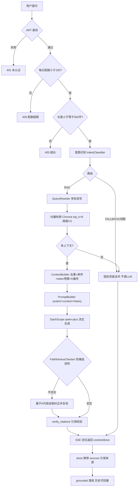
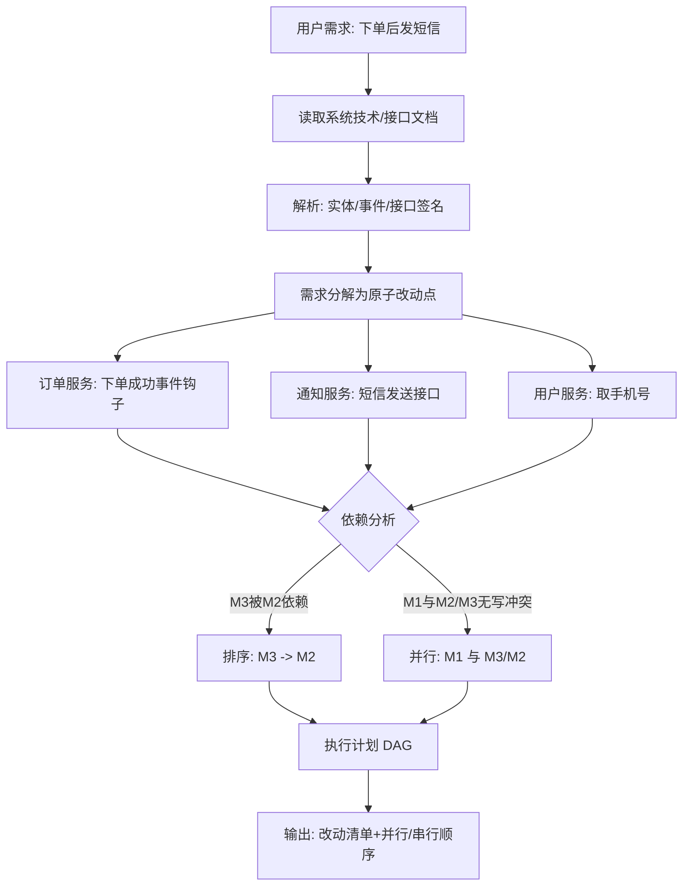

# 项目说明

## 项目简介

AI智能客服系统是一个基于RAG（检索增强生成）技术的企业级智能客服解决方案。系统通过向量检索和大语言模型生成，实现基于知识库的智能问答，为企业提供7x24小时不间断的智能客户服务。

## 核心特性

### 1. 智能问答
- 基于知识库的精准问答
- 支持多轮对话，理解上下文
- 流式输出，实时响应
- 引用来源，可追溯

### 2. 知识库管理
- 支持txt、md、pdf、docx格式文档
- 异步后台处理
- 自动分块和向量化
- 级联删除保证一致性

### 3. 模型支持
- 云端模型：DashScope qwen-plus（通义千问，本项目唯一 LLM/Embedding 提供方）
- 向量化：DashScope text-embedding-v3（1024 维）
- 注：原设计的本地 Ollama / sentence-transformers 可选路径已在实现中移除，当前仅支持云端 DashScope

### 4. 业务规则
- 消息长度限制：500字符
- 每日配额：100次提问
- 文件大小限制：10MB
- 相似度阈值：0.6（降级至0.3）

### 5. 用户体验
- 流式响应，首字输出<500ms
- 会话管理，历史记录
- 反馈评价（点赞/点踩 + 结构化原因 + 文字评论），持续优化
- 管理后台反馈模块：集中查看、筛选与统计全量用户反馈
- 友好的错误提示

## 技术栈

### 后端
- **框架**: FastAPI 0.109.0
- **数据库**: MySQL 8.0 + SQLAlchemy 2.0
- **向量数据库**: Chroma 0.4.22
- **LLM**: DashScope qwen-plus（通义千问，云端）
- **Embedding**: DashScope text-embedding-v3（云端，1024 维）
- **认证**: JWT (python-jose)
- **密码加密**: bcrypt (passlib)

### 前端
- **框架**: React 18
- **构建工具**: Vite
- **语言**: TypeScript
- **UI组件**: Ant Design
- **路由**: React Router
- **HTTP客户端**: Axios

### 基础设施
- **Python**: 3.9+
- **Node.js**: 16+
- **MySQL**: 8.0+

## 项目结构

```
5day/
├── backend/                 # 后端项目
│   ├── app/
│   │   ├── api/            # API路由
│   │   │   ├── auth.py     # 认证接口
│   │   │   ├── session.py  # 会话接口
│   │   │   ├── knowledge.py # 知识库接口
│   │   │   ├── chat.py     # 聊天接口
│   │   │   ├── feedback.py # 反馈接口（用户侧）
│   │   │   └── admin_feedback.py # 管理后台反馈接口（管理员侧）
│   │   ├── core/           # 核心模块
│   │   │   ├── exceptions.py    # 自定义异常
│   │   │   ├── response.py      # 统一响应
│   │   │   ├── exception_handlers.py  # 异常处理器
│   │   │   └── logging.py       # 日志配置
│   │   ├── models/         # SQLAlchemy模型
│   │   │   ├── user.py
│   │   │   ├── session.py
│   │   │   ├── message.py
│   │   │   ├── message_citation.py
│   │   │   ├── kb_document.py
│   │   │   ├── kb_chunk.py
│   │   │   ├── feedback.py
│   │   │   └── usage_quota.py
│   │   ├── rag/            # RAG核心模块
│   │   │   ├── loader.py       # 文档加载器
│   │   │   ├── splitter.py     # 文本分割器
│   │   │   ├── embedder.py     # 向量化器
│   │   │   ├── vector_store.py # 向量存储
│   │   │   ├── retriever.py    # 检索器
│   │   │   ├── context_builder.py # 上下文构建器
│   │   │   ├── prompt_builder.py  # 提示构建器
│   │   │   └── llm_client.py      # LLM客户端
│   │   ├── schemas/        # Pydantic模式
│   │   ├── services/       # 业务逻辑
│   │   ├── utils/          # 工具函数
│   │   ├── database.py     # 数据库连接
│   │   ├── config.py       # 配置管理
│   │   └── main.py         # 应用入口
│   ├── init_db.sql         # 数据库初始化
│   ├── requirements.txt     # Python依赖
│   ├── .env.example        # 环境变量模板
│   └── README.md           # 后端说明
├── frontend/               # 前端项目
│   ├── src/
│   │   ├── pages/          # 页面组件
│   │   │   ├── Login.tsx
│   │   │   ├── Sessions.tsx
│   │   │   └── KnowledgeBase.tsx
│   │   ├── utils/          # 工具函数
│   │   │   └── request.ts  # HTTP请求封装
│   │   ├── App.tsx         # 应用组件
│   │   └── main.tsx        # 入口文件
│   ├── package.json        # 项目配置
│   ├── vite.config.ts      # Vite配置
│   ├── tsconfig.json       # TypeScript配置
│   └── README.md           # 前端说明
├── spike/                  # Spike测试
│   ├── test_llm.py         # LLM连接测试
│   ├── test_embedding.py   # Embedding测试
│   ├── test_chroma.py      # Chroma测试
│   ├── requirements.txt     # Spike依赖
│   └── README.md           # Spike说明
├── seed_docs/              # 种子知识文档
│   ├── 产品介绍.md
│   ├── 常见问题FAQ.md
│   └── 退换货政策.md
├── docs/                   # 项目文档
│   ├── 数据库设计.md
│   ├── API文档.md
│   ├── AI架构设计.md
│   ├── 业务流程说明.md
│   ├── 代码规范.md
│   ├── 技术栈选型.md
│   └── 开发流程规范.md
├── 项目说明.md              # 项目说明（根目录）
├── 运行指南.md              # 运行指南（根目录）
└── AI智能客服系统_执行方案.md  # 执行方案
```

## 核心模块说明

### API层 (`app/api/`)
负责HTTP接口定义和请求处理，包括认证、会话、知识库、聊天、反馈等模块。

### Service层 (`app/services/`)
业务逻辑层，处理复杂的业务规则，如配额检查、会话管理、文档处理等。

### RAG Core层 (`app/rag/`)
AI核心模块，实现RAG pipeline：
- **Loader**: 文档加载（txt/md/pdf/docx）
- **Splitter**: 文本分割（中文优化）
- **Embedder**: 文本向量化（云端/本地）
- **VectorStore**: 向量存储（Chroma）
- **Retriever**: 相似度检索
- **ContextBuilder**: 上下文构建
- **PromptBuilder**: 提示构建
- **LLMClient**: LLM调用（流式）

### Infra层 (`app/core/`)
基础设施层，提供统一异常处理、响应格式、日志配置等。

## 数据模型

### 用户表 (users)
存储用户账户信息，支持手机号和邮箱登录。

### 会话表 (sessions)
存储对话会话，记录标题、意图、消息数等。

### 消息表 (messages)
存储对话消息，记录角色、内容、token数、延迟等。

### 消息引用表 (message_citations)
存储AI回答的引用来源，支持溯源。

### 知识库文档表 (kb_documents)
存储上传的文档元数据，支持状态机管理。

### 知识库分块表 (kb_chunks)
存储文档分块内容，与Chroma向量一一对应。

### 反馈表 (feedbacks)
存储用户对回答的评价（点赞/点踩）。点踩时可记录结构化原因（reason：答非所问/事实错误/没召回/太啰嗦/其他）与文字评论；管理员可通过管理后台查看全量反馈。详见 `docs/数据库设计.md` 与 `docs/API文档.md`。

### 使用配额表 (usage_quota)
跟踪用户每日提问次数。

## 部署架构

### 开发环境
```
Frontend (Vite Dev Server) → Backend (FastAPI) → MySQL + Chroma
```

### 生产环境
```
Nginx → Frontend (Static Files) → Backend (Uvicorn) → MySQL + Chroma
```

## 性能指标

### 响应时间
- 首字输出：<500ms
- 平均响应：<2s
- 文档处理：<3min（10MB）

### 并发能力
- 支持高并发访问
- 异步后台处理
- 流式响应减少等待

### 质量指标
- 检索准确率：>80%
- 回答准确率：>75%
- 引用准确率：>90%

## 安全设计

### 认证授权
- JWT Token认证
- Token有效期24小时
- 密码bcrypt加密
- Salt增强安全性

### 数据安全
- 敏感信息不存数据库
- API Key环境变量配置
- 用户数据隔离
- 文件上传限制

### 接口安全
- 统一异常处理
- 参数验证
- 配额限制
- CORS配置

## 扩展性

### 模型扩展
- 支持多种LLM提供商
- 支持多种Embedding模型
- 配置化模型选择

### 知识库扩展
- 支持多知识库
- 知识库隔离
- 元数据过滤

### 架构扩展
- 分层架构便于扩展
- 模块化设计
- 插件化RAG组件

## 监控与日志

### 日志记录
- 结构化日志
- 分级日志（DEBUG/INFO/WARNING/ERROR）
- 关键操作日志

### 错误追踪
- 统一异常处理
- 详细错误信息
- 错误码规范

### 性能监控
- 响应时间记录
- Token使用统计
- 检索质量监控

## 开发规范

### 代码规范
- 分层架构，职责清晰
- 统一异常处理
- 统一响应格式
- 详细的注释（RAG核心模块）

### Git规范
- 分支管理
- 提交信息规范
- 代码审查

### 测试规范
- 单元测试
- 集成测试
- Spike测试验证依赖

## 自建框架说明

本项目采用**自研mini-framework**架构，不依赖LangChain/LangGraph/LlamaIndex等Agent/RAG框架，以展示对底层原理的深度理解。

### 框架设计原则

**核心约束（依据笔试题要求）：**
- 禁止引入LangChain、LangGraph、LlamaIndex、Haystack、AutoGen、Semantic-Kernel、CrewAI等提供Agent/RAG编排能力的上层框架
- 允许复用SDK级library：LLM/Embedding官方SDK、向量库客户端、tiktoken、SQLAlchemy、FastAPI等
- 当前`requirements.txt`与全仓代码无LangChain等依赖（已grep验证）

### 框架原语（app/framework/）

对标LangChain核心概念，但全部from-scratch实现：

| 模块 | 对标LangChain | 自研实现要点 | 为何自建 |
|------|---------------|-------------|----------|
| **Tool协议** | BaseTool | `BaseTool(name, description, args_schema, run)` + `ToolRegistry` | 展示"工具=描述+schema+执行"三元组，避免@tool装饰器黑箱 |
| **LLM抽象** | BaseChatModel | `BaseLLM.chat()` + `DashScopeLLM` + `FallbackLLM`降级状态机 | 统一接口+降级逻辑前置，避免业务代码散落try/except |
| **Memory抽象** | BaseMemory | `WindowMemory`/`CompactionMemory` + `QueryRewriter` | 多轮记忆是Agent核心原理，展示token预算与摘要压缩策略 |
| **Retriever接口** | BaseRetriever | `VectorRetriever` + `ContextBuilder` L1-L4算子 | 重排/三明治/分层摘要/校验是检索保障的硬实现 |
| **Prompt模板** | PromptTemplate | 极简`{var}`替换 + system prompt结构化拼装 | 避免框架黑箱，确保输出约束可控 |
| **Agent编排** | AgentExecutor | `ReActAgent`线性循环（Thought→Action→Observation） | 线性ReAct已覆盖任务拆解，图运行时属过度设计 |
| **意图路由** | Router | `IntentRouter`映射表（意图→目标） | 意图识别加分项+终极挑战"路由到微服务"具象化 |
| **Chain组合** | Chain | `RAGChain`串联retriever→context→prompt→llm | 把RAG pipeline封装为可复用单元 |

> **接入状态（诚信声明）**：上述原语中，`llm.py`（DashScopeLLM/FallbackLLM）与 `memory.py`（QueryRewriter）**已接入生产主流程**（分别被 `rag/llm_client.py`、`services/chat_service.py` 调用）；`agent.py`/`tools.py`/`chain.py`/`planner.py`/`prompt.py`/`retriever.py` 为**原理演示库**，用于对标 LangChain 概念展示底层原理，**未接入生产 RAG 主流程**（生产主流程实现在 `app/rag/` + `app/services/chat_service.py`）。详见 `app/framework/README.md`。

### 关键算法实现

**自研tool_call解析协议：**
- 让LLM以固定格式输出：`Action: <tool_name>` / `Action Input: <json>`
- 自研`parse_action(text)`：正则/JSON解析+schema校验+字段缺失兜底
- 动机：显性化"模型输出解析"原理、不绑定OpenAI专属SDK

**agent_loop主循环与死循环防护：**
- `max_steps`硬上限；每步Observation回灌上下文
- 记录Step列表用于trace与可解释性展示

**Memory压缩触发：**
- `CompactionMemory`：当`token_usage() > threshold`时，对最早(N-k)轮调用LLM摘要，替换为summary消息

**ContextBuilder L1-L4：**
- L1重排：cross-encoder分数或规则分数融合
- L2三明治：高置信块置顶+置底，中低置信居中
- L3分层摘要：Map（逐块摘要）→Reduce（汇总）
- L4校验：剔除编号越界/低分块，与[K编号]引用一致性核对

**降级状态机：**
- `FallbackLLM`维护`primary_ok`标志；主用连续失败→切换secondary；secondary成功后按策略回切

### 工程判断

与LangChain**形似神异**：都是"LLM推理→执行→观察→再推理"的逐步循环，但本方案是**嵌在主流程的线性循环+清晰接口**，而非图运行时。对单域客服足够、可控、易硬化。

接口预留`Planner`/`BaseAgent`可替换，未来若升级为图编排，只需新增`GraphAgent`实现，不动业务层——这正是"框架化"的体现。

全部原语可单测、可在`docs/AI架构设计.md`逐一对照LangChain概念说明"我们实现了等价的X，但未引入框架"——直接服务笔试题L129/L171-176与面试叙事。

## AI生成代码优化与RAG质量评估

### AI生成代码优化修正

本项目在开发过程中对AI生成的代码进行了以下优化修正：

**1. 架构层面优化**
- 将平铺的工具链/记忆/检索功能提升为**框架原语**，独立成`app/framework/`包
- 明确禁用LangChain等框架，采用自研mini-framework展示原理理解
- 建立清晰的三层架构：业务编排层→框架原语层→基础设施层

**2. 代码质量优化**
- 统一异常处理机制，避免散落的try/except
- 统一响应格式（ApiResponse信封），降低客户端解析成本
- 补充完整的单元测试覆盖（test_retriever、test_context_builder、test_prompt_builder）
- 优化数据库操作（配额原子性UPSERT、索引优化）

**3. 安全性优化**
- 实现Prompt Injection防护（注入模式过滤、system/user分通道、输出约束）
- 添加全局限流/防刷（slowapi、IP级限流、全局RPS双控）
- JWT密钥强制要求（至少32字符）
- 密码bcrypt+Salt双重加密

**4. 性能优化**
- 实现检索重排序（召回top_k=20→Reranker重排取top_5）
- 添加检索保障算子（重排、三明治、分层摘要、校验）
- 流式响应优化（SSE协议、首字输出<500ms）
- 异步后台处理（文档向量化）

### RAG质量评估方法

**1. 检索准确率评估**
- 使用评测集（25题）测试检索召回率
- 指标：Top-1准确率、Top-5准确率、MRR（Mean Reciprocal Rank）
- 目标：检索准确率>80%

**2. 回答准确率评估**
- 人工评估AI回答的相关性和准确性
- 分类：完全正确、部分正确、错误、无关
- 目标：回答准确率>75%

**3. 引用准确率评估**
- 检查AI回答中的引用是否真实存在于知识库
- 验证[K编号]与实际引用的一致性
- 目标：引用准确率>90%

**4. 幻觉检测**
- 实现verify_citations校验机制
- 检测回答内容是否超出检索片段范围
- 对超出范围的回答进行标记或拒绝

**5. A/B测试**
- 对比不同检索策略（纯向量检索vs重排序检索）
- 对比不同LLM模型（qwen-plus vs qwen-max）
- 对比不同相似度阈值（0.5 vs 0.6）

**6. 用户反馈分析**
- 收集用户点赞/点踩数据，点踩时附带结构化原因（reason）与文字评论，便于归因
- 管理后台集中展示全量反馈（`GET /api/admin/feedbacks`），支持按评分/原因/关键词/时间区间筛选与统计概览
- 分析低分回答的共同特征（如「没召回」「事实错误」集中出现），定位失败 Case 并关联知识与消息
- 将高频失败问题回流至评测集，形成「收集 → 分析 → 优化 → 回流」的持续迭代闭环

**7. 持续监控**
- 记录每次检索的相似度分数分布
- 监控无检索结果的query占比
- 追踪token使用量和响应时间

通过以上多维度的评估方法，确保RAG系统的质量持续提升。

## 技术选型及原因

> 对应笔试题"项目说明文档需包含：技术选型及原因"。完整版见 `docs/技术栈选型.md`。

| 维度 | 选型 | 原因 |
|---|---|---|
| LLM | DashScope 通义千问（qwen-plus） | 国内网络稳定可达；兼容 OpenAI SDK（`base_url` 切换即可），代码无需为厂商改写；免费额度覆盖开发测试；原生支持流式。 |
| Embedding | DashScope text-embedding-v3（1024维） | 与 LLM 同生态、共用同一 Key；中文语义质量高；1024 维兼顾精度与存储；与 Chroma 集合维度一致，免改向量库结构。 |
| 向量库 | Chroma（本地文件型） | 无需独立服务/账号，首次运行自动创建；支持元数据过滤与按 ID 删除（满足"删除文档同步清向量"）；本地文件模式适合快速开发。 |
| 数据库 | MySQL 8.0 | 题目要求；存储用户/会话/消息/知识库元数据；InnoDB 事务保证配额原子性。 |
| 后端框架 | FastAPI | 原生 async 支持 SSE 流式；自动 OpenAPI 文档；Pydantic 校验。 |
| 前端 | React + TypeScript | 类型安全；生态成熟；antd 组件库快速搭建。 |

> 说明：原设计的"本地 Ollama 降级 / 本地 bge 离线 embedding"可选路径已在实现中移除，当前仅使用云端 DashScope，降低部署复杂度与依赖体积。

## 整体 AI 架构图（RAG 链路）

> 对应笔试题"项目说明文档需包含：整体 AI 架构图"。模块级设计见 `docs/AI架构设计.md`，完整问答链路见 `docs/业务流程说明.md`。



## 业务思考：AI 特有工程问题的处理（重点）

> 对应笔试题"项目说明文档需包含：业务思考——你如何处理'检索为空'、'上下文超长'、'LLM 幻觉'等 AI 特有的工程问题？（重点）"

### 1. 检索为空（空检索）
- **问题**：用户提问在知识库中无相关片段，若仍把空上下文喂给 LLM，模型极易编造答案。
- **处理**：路由层即判别——检索为空（`no_context`）或意图为闲聊/投诉（`FALLBACK`）时，**不注入任何知识库上下文、不调用 LLM**，直接返回配置中的**固定标准兜底话术**（`settings.fallback_message`）。
- **效果**：① 话术固定一致，不会每次生成不同文案；② 彻底杜绝编造（无上下文可供编造）；③ 省一次 LLM 调用，降延迟与成本。
- **代码**：`chat_service.py` 的 `finish_reason in ("fallback","no_context")` 分支；`config.py:fallback_message`。

### 2. 上下文超长（注意力稀释 / token 溢出）
- **问题**：检索返回片段过多 → 上下文超出 LLM token 窗口，且"注意力稀释"导致关键规则被遗漏。
- **处理**：
  - **token 预算截断**：`ContextBuilder` 设 2000 token 预算，按相似度排序后截断，保证不溢出。
  - **三明治布局（L2）**：高置信块置顶+置底（首尾注意力权重高），中低置信居中，提升关键信息被"看到"的概率。
  - **去重**：内容去重，避免重复片段占预算。
  - **[K编号]引用绑定**：上下文每块带 `[K1]/[K2]...` 编号，与 sources 严格 1:1，便于后续校验与溯源。
- **大规模语料扩展（加分项设计）**：L1 cross-encoder 重排、L3 Map-Reduce 分层摘要已实现但默认关闭（小语料下 top_k=8 已足够）；大语料场景可开启以进一步保障。详见 `docs/AI架构设计.md`。

### 3. LLM 幻觉（编造）
- **问题**：LLM 生成内容超出检索片段范围，编造不存在的规则/事实。
- **处理（三重防线）**：
  1. **Prompt 约束**：system prompt 明确"基于知识库内容回答，无相关信息则告知无法回答，不要编造"。
  2. **FaithfulnessChecker（LLM-as-Judge 自检）**：生成后用 LLM 比对"回答↔召回上下文"，判定 is_faithful；不忠实则基于 [K] 内容自我纠正并复检（最多 N 次），仍不通过则标记 `grounded=False`。
  3. **verify_citations 引用校验**：校验回答中的 [K编号] 是否真实存在于上下文，剔除越界引用。
- **落库与展示**：`grounded`/`unsupported_claims` 持久化到 messages 表；前端对 `grounded=false` 显示黄色告警条，历史可回看。
- **代码**：`rag/faithfulness.py`、`chat_service.py:428/459`、`models/message.py`。

## 使用 AI 编程工具的体会（必须说明）

> 对应笔试题"项目说明文档需包含：使用 AI 编程工具的体会（必须说明）"。优化修正细节见上文"AI生成代码优化与RAG质量评估"。

- **使用的 AI 工具**：WorkBuddy（AI 编程助手，用于代码生成/重构/审查）+ DashScope 通义千问（LLM API，驱动 RAG 链路）。
- **体会**：AI 工具显著加速了样板代码（CRUD、SSE 解析、表单、ORM 模型）的生成，但在 RAG 核心链路上必须人工把关——AI 生成的检索/上下文/防编造代码常出现"形似而神不至"的问题，例如：检索去重用哈希在跨进程下不确定、引用 [K编号] 与来源未严格对齐、降级状态机成功计数清零逻辑错误导致熔断失效、流式路径漏改方法签名致 TypeError 等，均经人工逐行审查后修正。
- **对 AI 生成代码的优化修正**：见"AI生成代码优化修正"节（架构/代码质量/安全/性能四方面）。
- **RAG 回答质量评估与验证**：见"RAG质量评估方法"节（检索准确率/回答准确率/引用准确率/幻觉检测/A-B测试/用户反馈/持续监控），含简单人工测试说明。

## 终极挑战：Agent 任务拆解能力设计

> 对应笔试题"终极挑战 - 改造系统实现 AI Agent 的任务拆解能力"。本节为设计思路（流程图+示例），代码层面在 `app/framework/` 提供原语演示（ReActAgent/ToolRegistry，未接入生产主流程）。

**场景**：用户需求"用户下单后自动发送短信通知"，Agent 收到需求 + 一套系统技术/接口文档后，需判断：改哪几个微服务？哪些可并行？哪些有依赖须排序？



**拆解思路**：
1. **需求分解**：把需求拆为原子改动点（每个改动点 = 一个微服务的一个接口/事件/字段变更）。
2. **依赖分析**：若改动点 B 需要调用 A 新增的接口/字段，则 A→B 有依赖（须先 A 后 B）；通过解析接口签名与实体引用构建依赖图。
3. **并行/串行判定**：无写冲突且无调用依赖的改动点可并行；有依赖的按拓扑序串行。
4. **示例结论**：M3（用户服务取手机号）→ M2（通知服务发短信）有依赖须串行；M1（订单事件钩子）与 M2/M3 无写冲突可并行。
5. **本项目的对应实现**：`app/framework/agent.py` 的 `ReActAgent` 线性循环（Thought→Action→Observation）+ `ToolRegistry` 提供工具调度原语，可承载此类"分解→调用工具→观察→再推理"的循环；当前作为原理演示库，未接入生产 RAG 主流程。

## 未来规划

### 短期
- 完善单元测试
- 优化检索质量
- 增加更多文档格式支持

### 中期
- 多租户支持
- 知识库版本管理
- A/B测试不同模型

### 长期
- 多语言支持
- 语音问答
- 图像问答
